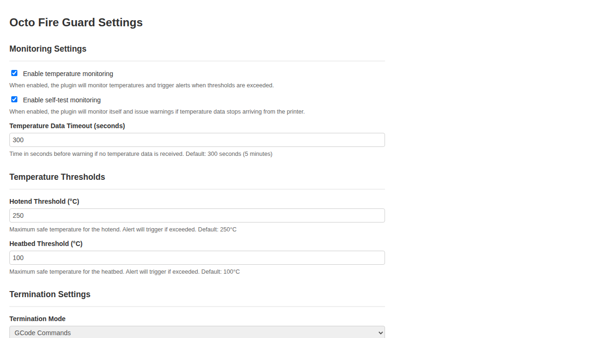
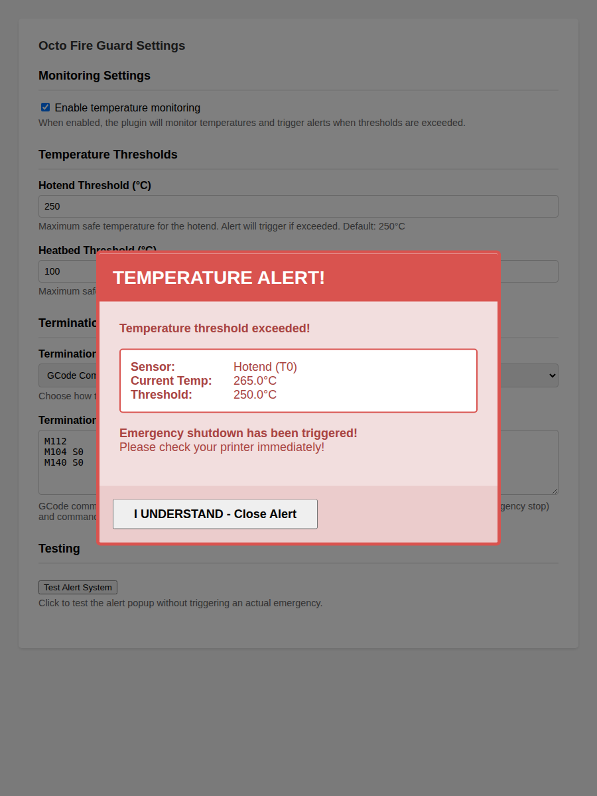

# Octo Fire Guard

[](https://github.com/rdar-lab/octo-fire-guard/actions/workflows/tests.yml)

An OctoPrint plugin that monitors printer temperatures in real-time to prevent fire hazards. The plugin watches both hotend and heatbed temperatures and triggers emergency shutdown procedures when configurable thresholds are exceeded.

You must ask yourself why?

Well, I had an incident that the external mosfet failed in a closed-circuit mode. That meant that the temperature kept raising with nothing on the printer firmware that can stop it, nothing! only shuting down the power supply (PSU) to the printer can prevent fire in that case. I decided to hook the printer to a smart switch and install PSU control to allow the power to be cut off automatically on that case.

## Features

- **Real-time Temperature Monitoring**: Continuously monitors hotend and heatbed temperatures via OctoPrint's temperature data stream
- **Self-Test Monitoring**: Automatically detects if temperature data stops arriving and issues warnings
- **Dual Threshold Configuration**: Separate configurable thresholds for hotend (default: 250°C) and heatbed (default: 100°C)
- **Immediate Alert System**: Displays a prominent alert popup in the OctoPrint interface when thresholds are exceeded
- **Flexible Emergency Response**: Choose between two termination modes:
  - **GCode Commands**: Execute custom GCode commands (default: M112 emergency stop + heater shutdown)
  - **PSU Control Integration**: Turn off power entirely via PSU Control plugin
- **User-Friendly Interface**: Easy-to-use settings panel with test functionality
- **Audio Alerts**: Plays an alert sound when temperature threshold is exceeded

## Installation

Install via the bundled [Plugin Manager](https://docs.octoprint.org/en/master/bundledplugins/pluginmanager.html) or manually using this URL:

```
https://github.com/rdar-lab/octo-fire-guard/archive/main.zip
```

## Plugin Interface

### Settings Panel

The plugin provides an intuitive settings panel in OctoPrint where you can configure temperature thresholds, termination modes, and test the alert system:



### Temperature Alert

When a temperature threshold is exceeded, a prominent alert modal appears with critical information:



## Configuration

After installation, configure the plugin in OctoPrint Settings → Plugins → Octo Fire Guard:

### Temperature Thresholds

- **Hotend Threshold**: Maximum safe temperature for the hotend in °C (default: 250°C)
- **Heatbed Threshold**: Maximum safe temperature for the heatbed in °C (default: 100°C)

### Self-Test Monitoring

- **Enable Self-Test Monitoring**: When enabled, the plugin monitors itself to ensure it's receiving temperature data from the printer
- **Temperature Data Timeout**: Time in seconds before issuing a warning if no temperature data is received (default: 300 seconds / 5 minutes)

If the printer is connected but the plugin doesn't receive temperature data for the configured timeout period, it will issue a warning notification. This helps ensure the plugin is functioning correctly and actively monitoring your printer.

### Termination Mode

Choose how the plugin responds when a threshold is exceeded:

#### GCode Commands Mode
Execute custom GCode commands to handle the emergency. Default commands:
```gcode
M112        # Emergency stop
M104 S0     # Turn off hotend
M140 S0     # Turn off heatbed
```

You can customize these commands to suit your printer's requirements.

#### PSU Control Mode
Integrates with the [PSU Control plugin](https://plugins.octoprint.org/plugins/psucontrol/) to turn off power completely. This mode:
1. Turns off heaters using GCode
2. Signals the PSU Control plugin to cut power

**Note**: Requires the PSU Control plugin to be installed and configured.

## How It Works

### Temperature Monitoring

1. The plugin subscribes to OctoPrint's temperature callback system
2. Every time temperature data is received from the printer:
   - Checks if any hotend temperature exceeds the configured threshold
   - Checks if the heatbed temperature exceeds the configured threshold
   - Records the timestamp of received data for self-test monitoring
3. When a threshold is exceeded:
   - Logs a warning message
   - Displays a prominent alert popup in the OctoPrint UI
   - Plays an audio alert (if supported by the browser)
   - Executes the configured termination commands
4. The alert remains until the user acknowledges it
5. Temperature monitoring continues, with a cooldown period to prevent repeated alerts

### Self-Test Monitoring

1. A background timer checks every 30 seconds if temperature data is being received
2. If the printer is connected but no temperature data has been received for the configured timeout period:
   - Issues a warning notification to the OctoPrint notification center
   - Logs a warning message
3. The warning state clears automatically when temperature data resumes
4. This ensures the plugin is actively monitoring and hasn't stopped receiving data

## Testing

The plugin provides two test buttons in the settings panel to verify functionality:

- **Test Alert System**: Tests the alert popup display without triggering emergency actions. This verifies that the visual alert, audio notification, and user interface components work correctly.
- **Test Emergency Actions**: Tests the actual emergency response by executing your configured termination commands (GCode or PSU control). Use this to verify that your emergency shutdown procedure works correctly before an actual emergency occurs.

**Important**: The "Test Emergency Actions" button will execute the real emergency shutdown commands configured in your termination settings. Make sure your printer is in a safe state before testing.

## Safety Considerations

- **This plugin is a safety feature, not a replacement for proper printer supervision**
- Set thresholds appropriate for your printer and materials
- Regularly test the plugin to ensure it's functioning correctly
- Ensure your printer's firmware has proper thermal runaway protection
- For PSU Control mode, verify your PSU Control setup works correctly before relying on it

## Requirements

- OctoPrint 1.4.0 or higher
- Python 3.8 or higher
- For PSU Control mode: PSU Control plugin installed and configured

## Development

### Plugin Structure

```
octo-fire-guard/
├── octoprint_octo_fire_guard/
│   ├── __init__.py              # Main plugin logic
│   ├── static/
│   │   ├── css/
│   │   │   └── octo_fire_guard.css
│   │   └── js/
│   │       └── octo_fire_guard.js
│   └── templates/
│       └── octo_fire_guard_settings.jinja2
├── tests/
│   ├── __init__.py
│   ├── test_octo_fire_guard.py  # Comprehensive unit tests
│   └── README.md                # Test documentation
├── setup.py
├── run_tests.py                 # Test runner script
├── MANIFEST.in
├── LICENSE
└── README.md
```

### Key Components

- **Temperature Monitoring**: Uses OctoPrint's `octoprint.comm.protocol.temperatures.received` hook
- **Self-Test Monitoring**: Uses `octoprint.util.RepeatedTimer` for background monitoring
- **Alert System**: Sends plugin messages to the frontend for display
- **Emergency Response**: Executes termination commands via printer commands or plugin messages

### Testing

The plugin includes a comprehensive unit test suite covering all major functionality, including the new self-test monitoring feature.

To run the tests:

```bash
python3 run_tests.py
```

Or run tests directly:

```bash
python3 tests/test_octo_fire_guard.py -v
```

See [tests/README.md](tests/README.md) for detailed information about the test suite.

## License

This project is licensed under the MIT License - see the [LICENSE](LICENSE) file for details.

## Contributing

Contributions are welcome! Please feel free to submit a Pull Request.

## Support

If you encounter any issues or have suggestions, please [open an issue](https://github.com/rdar-lab/octo-fire-guard/issues) on GitHub.
